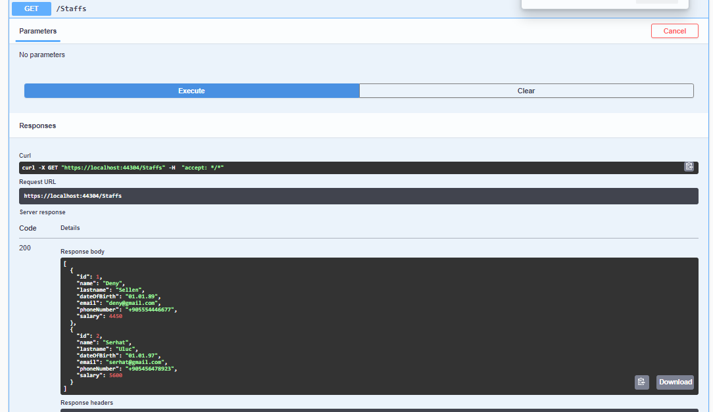
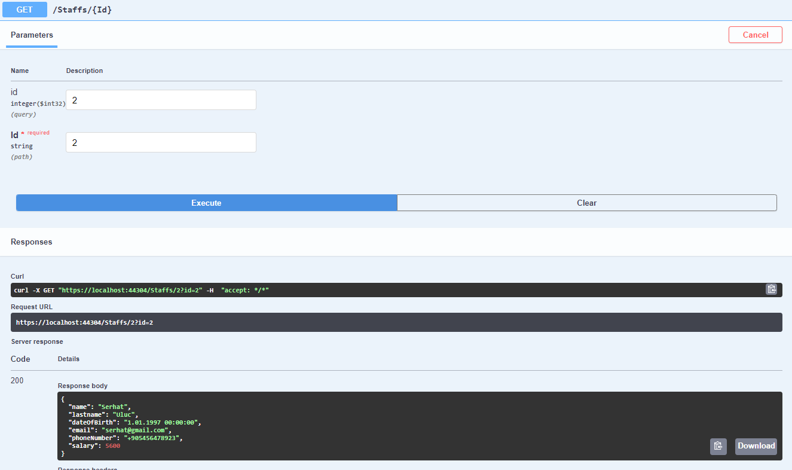
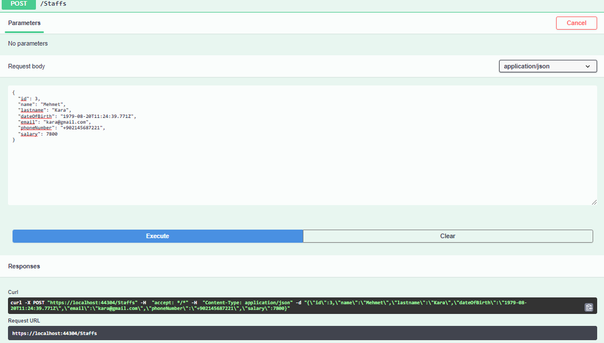
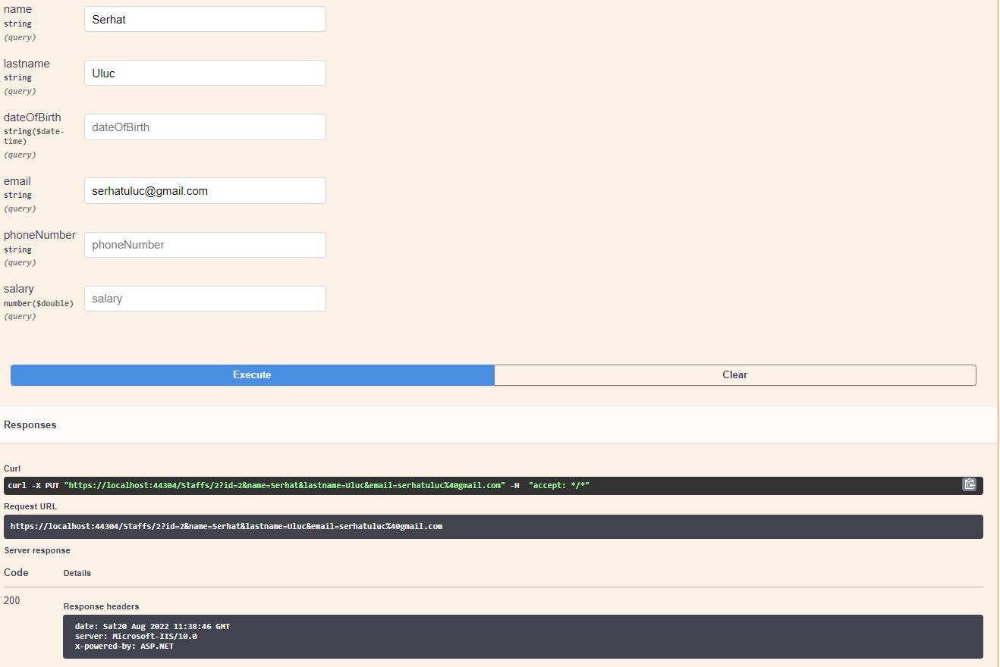
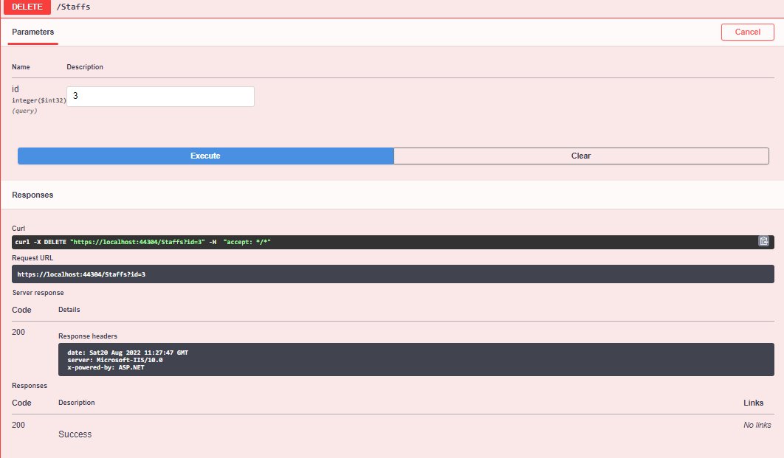

# assignment-2-serhatuluc
assignment-2-serhatuluc created by GitHub Classroom
<h3>Validation</h3>

Merhabalar, Ödevde validasyonlar FluentValidation kütüphanesi kullanılarak sağlandı. Telefon numarası, email, isim ve soyisim formatı ise Fluentvalidation
kütüphanesinden "match" komutu içerisinde regex kullanılarak kontrolü sağlandı. 

 
<h3> FluentValidaiton'dan gelen "when" komutu </h3>

Projenin içerisinde aynı zamanda iki extension bulunmaktadır. Bu
extensionlar FluentValidation kütüphanesinden gelen "when" komutu içerisinde kullanıldı. Bu komut boolean değer döndüren fonksiyonları içerisine kabul eder.
Eğer döndürülen değer true ise validasyon komutu çalışır. Bu özellik update requesti için kullanıldı. UpdateStaffCommandValidator içerisinde kullanılan bu komut
 sayesinde kullanıcı id girdikten sonra diğerlerine dokunmadan tek özelliği değiştirebilecektir.

 
<h3> Model</h3>

Bütün http requestlerde model kullanıldı. Get ve GetById için modelview kullanılarak dönüş yapıldı.

 
<h3> Get</h3>

 
<h3> GetById</h3>

 
<h3> Post</h3>

 
<h3> Put</h3>

 
<h3> Delete</h3>

